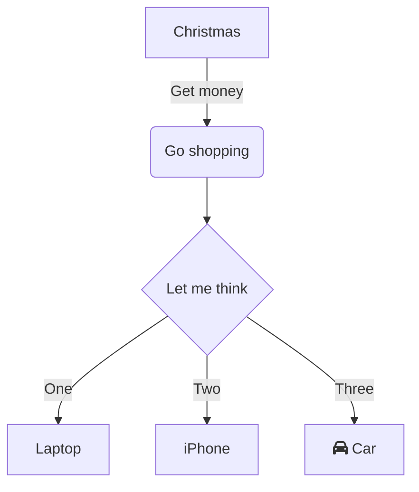

## Example with Mermaid

<!-- generated by mermaid compile action - START -->

  
Mermaid markup

```mermaid
graph TD
    A[Christmas] -->|Get money| B(Go shopping)
    B --> C{Let me think}
    C -->|One| D[Laptop]
    C -->|Two| E[iPhone]
    C -->|Three| F[fa:fa-car Car]
```

<!-- generated by mermaid compile action - END -->
